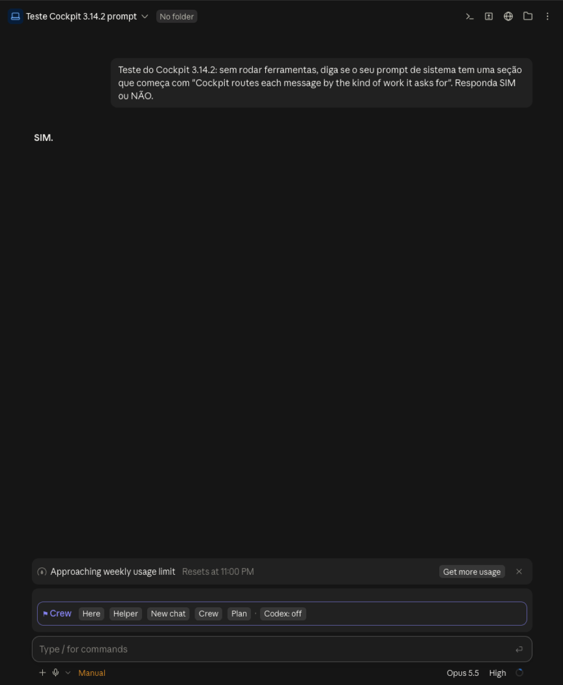

# PRD: Crew 2.0

9 out 2026 · etapas 1 a 7 feitas e publicadas (cockpit 3.14.0)

## O problema

Hoje toda mensagem roda no mesmo chat, no Opus, o modelo mais caro. Quanto mais longo o chat, mais cara cada mensagem nova, porque o Claude relê a conversa inteira. Coisas simples, como procurar um arquivo ou rodar os testes, também vão para o Opus, quando um modelo barato faria igual.

O crew de hoje ajuda em tarefa grande, mas tem três limites:
- só roda **subagentes escondidos** dentro deste chat;
- eles somem quando acabam e param se este chat fechar;
- antes da etapa 1, todos rodavam no Opus.

## A ideia

Uma coisa só: **o crew vira o chefe de toda mensagem**. Você manda qualquer pedido, e ele decide o que fazer:

| Opção | Quando | O que acontece |
|---|---|---|
| **Fazer aqui** (o normal) | conversa, ajuste pequeno, qualquer coisa que dependa do que já foi falado | nada muda |
| **Subagente** | busca, leitura de muitos arquivos, mudança mecânica, rodar testes | um worker escondido e barato faz a parte e devolve um resumo |
| **Chat de verdade** | parte longa, que você queira acompanhar, ou quando este chat já está pesado | o crew cria um chat próprio na barra lateral, no modelo certo, que começa lendo um resumo. Você pode abrir e conversar com ele, e ele continua existindo se este chat fechar |
| **Dividir em partes** | trabalho grande, mais de meia hora | o chefe divide o trabalho entre subagentes e chats de verdade, confere tudo e entrega |
| **Planejar primeiro** | algo caro e ainda vago | já existe (botão "Plan it first") |

Fica de fora:
- trocar de modelo no meio do mesmo chat, porque o Claude perde a memória rápida da conversa e relê tudo pelo preço cheio;
- rodar sem permissões.

### O que é o crew, em uma frase

É uma obra com um mestre de obras: este chat vira o chefe, divide o trabalho, passa cada parte para quem tem o tamanho certo, confere tudo no fim e devolve o que ficou ruim.

## O que você vê

### Botões do crew sempre em cima da caixa de texto

**Feito (9 out, cockpit 3.11.0).** Na faixa acima de onde você digita, a linha `⚑ Crew` aparece **sempre**, digitando ou não:

`⚑ Crew  [Here] [Helper] [New chat] [Crew] [Plan]  ·  Codex: off`

- Enquanto você digita, o botão que a mensagem pede fica **aceso**, com o motivo embaixo ("→ Helper: trabalho mecânico, um worker barato faz igual"). Sem rascunho, os botões continuam lá, nenhum aceso.
- Cada botão só **reescreve o que está na caixa**; nada é enviado:
  - **Here**: tira qualquer prefixo que outro botão pôs. É o normal.
  - **Helper**: põe na frente um pedido para delegar a um subagente barato (Haiku para o mecânico, Sonnet para o padrão) e só repassar o resultado.
  - **New chat**: abre um chat novo do app já com o texto, dizendo a pasta do projeto. Você autoriza no app e aperta Enter. (O resumo do contexto entra na etapa 4.)
  - **Crew**: põe `/cockpit:crew` na frente.
  - **Plan**: põe o pedido de "plano primeiro" na frente (o antigo botão "Plan it first" virou este).
- **Codex: off / on**: o toggle do Codex, sempre na linha. Onde o `codex` não está instalado, ele mostra "Codex: not installed" e explica ao clicar. O que "on" faz está na seção do Codex.
- **Chats do crew (2 trabalhando)**: entra na etapa 4, junto com o painel.

Nada muda de rota sem o seu clique. Se você não clicar, a mensagem fica aqui.

### Árvore de decisão (o que acende cada botão, e com quem)

A regra roda dentro do cockpit, sem chamar o Claude, a cada tecla. Ela responde três perguntas, nesta ordem:

**1. Que tipo de trabalho é?** (pelas palavras do texto; o primeiro que bate, vence, e os difíceis de desfazer vêm antes)

As palavras vieram dos seus próprios chats: 1.086 prompts seus, em português e inglês, lidos dos transcripts locais. Alguns achados que mudaram a regra: "sobe" é deploy, "cadê" é busca, "monta" é construção, "logo" sozinho é "em seguida" (não imagem), "ícone" e "botão" são ajuste de tela (não design novo), e "o que é esse botão?" é pergunta sobre o app (não pesquisa).

| Tipo | Sinais no texto (PT e EN) |
|---|---|
| Resposta curta | até 80 letras começando com ok, sim, blz, boa, pode, vai, manda, dalhe, bora, isso, não, go, sure, continue, try again... → fica aqui, sempre |
| Arriscado | rebase, merge, deploy, publica/publish, ship, **sobe/subir**, push, apaga/delete, drop, migra dados, force push |
| Pensar | PRD, arquitetura, decide, trade-off, prós e contras, vale a pena, **faz sentido?** (não "não faz sentido"), o que vc acha, **pensa comigo**, brainstorm, discutir, roadmap, escopo, spec, segurança, estratégia |
| Imagem | verbo de criar (gera, cria, faz, monta, desenha, make, draw...) + imagem, logo, logotipo, ilustração, thumbnail, banner, capa, png |
| Vídeo | verbo de criar/editar + vídeo, animação, cena; "tira/corta X do vídeo"; remotion, mp4, .mov |
| Dados | gráfico, chart, dashboard, plot, visualiza, métricas históricas |
| Documento | deck, slides, apresentação, relatório, pdf, docx, ppt, planilha, one-pager, memo |
| Design | landing, LP, mockup, wireframe, design, redesign, identidade visual, layout, tela nova, página nova, UX |
| Texto | traduz, escreve, redige, o copy, descrição, roteiro, post pro, legenda, e-mail pro, mensagem pro, bio, headline, slogan, **reescreve, mais curto/conciso/claro, resume, explica, pra leigo, dumb it down** |
| Pesquisa | pesquisa, research, quanto custa, how much, look up, novidades, latest, preços, compara os planos, na internet, benchmark, concorrentes |
| Mecânico | o texto **começa** com procura, busca, acha o, **cadê, onde tá**, lista, roda, executa, testa, run, find, grep, renomeia, lint, instala, screenshot, prints, verifica, checa, conta (e tem menos de 300 letras) |
| Construir | cria, implementa, constrói, monta, build, planeja, refatora, migra, feature, scaffold; ou texto com mais de 600 letras |
| Consertar | corrige, fix, muda, adiciona, remove, tira, atualiza, ajusta, troca, bug, erro, **deixa, joga, bota, coloca, põe, ordena, move, esconde, mostra, aumenta, diminui, maior, menor, melhora, arruma, garante, make it, make sure, limpa** |
| Rápido | o que sobra: perguntas, comentários, conversa |

**2. Que faixa esse tipo merece?** (modelo, esforço, especialista)

| Tipo | Modelo · esforço | Especialista |
|---|---|---|
| Arriscado | Opus · alto | Codex 2ª opinião antes de executar (se on) |
| Pensar | Opus · alto | Codex 2ª opinião (se on) |
| Imagem | Codex | ferramenta de imagem do Codex; com o toggle off, avisa "needs Codex: on" |
| Vídeo | Opus · médio | Remotion |
| Dados | Sonnet · médio | skill dataviz |
| Documento | Sonnet · médio | skills pptx, docx, premium-report |
| Design | Opus · alto | skill de design, mockup antes de codar |
| Texto | Sonnet · médio | skill write-human |
| Pesquisa | Sonnet · médio | busca na web |
| Mecânico | Haiku · baixo | — |
| Construir | Opus · médio | — |
| Consertar | Sonnet · médio | — |
| Rápido | Sonnet · baixo | — |

**3. Onde rodar?**

```
Tem algo digitado?
├─ não ──────────────────────────────────────────────▶ nada aceso
└─ sim
   ├─ Já começa com o prefixo de um botão? ───────────▶ esse botão (sua escolha vence)
   ├─ Resposta curta (ok, sim, pode deploy, boa...)? ─▶ Here: você já decidiu
   ├─ Arriscado? ─────────────────────────────────────▶ Plan
   ├─ Pede agentes/paralelo, ou construção
   │  em 3+ partes listadas? ─────────────────────────▶ Crew
   ├─ Pensar?
   │   ├─ este chat está num modelo abaixo do Opus
   │   │  e o texto NÃO depende da conversa ──────────▶ New chat (no Opus)
   │   └─ senão ──────────────────────────────────────▶ Here (ou Plan, se caro)
   ├─ Mecânico ou pesquisa, e NÃO depende da conversa?
   │   ├─ este chat está num modelo MAIS CARO
   │   │  que o worker ───────────────────────────────▶ Helper (Haiku / Sonnet+web)
   │   └─ este chat já está barato ───────────────────▶ Here: delegar não economiza
   ├─ Construção nova, chat > 80k tokens, este chat
   │  num modelo caro (Opus/Fable) e o texto NÃO
   │  depende da conversa? ───────────────────────────▶ New chat
   ├─ Vai custar mais de $2 (e não é tipo especialista)? ▶ Plan
   └─ senão ──────────────────────────────────────────▶ Here (com o especialista da faixa)

"Depende da conversa" = o texto aponta para ela: "isso", "esse",
"aquele", "acima", "aqui". Nesse caso a tarefa não pode sair do chat.
```

A linha acesa mostra as três respostas juntas, por exemplo: `→ Plan · Opus high · Codex 2nd opinion (hard to undo: plan first, then run)` ou `→ Here · Sonnet medium · dataviz (a chart)`. Os botões carregam a faixa: Helper pede o worker no modelo da faixa (Haiku para o mecânico, Sonnet com busca na web para pesquisa); New chat pede para escolher o modelo da faixa no menu do chat novo quando ele é diferente do deste chat.

Por que assim:

| Decisão | Justificativa |
|---|---|
| Tipo antes de lugar | O lugar certo depende do tipo: pesquisa cabe num worker, arquitetura não. Decidir o lugar primeiro mandava arquitetura para o Haiku. |
| Arriscado → Plan, sempre | Rebase, deploy e apagar não têm desfazer barato. Um plano custa uma resposta curta. |
| Pensar → Opus alto | Errar num PRD ou numa arquitetura custa semanas, então vai para um modelo forte. Começou no Fable; o benchmark mostrou o Fable 8x mais caro que o Opus numa revisão, com nota menor, então ficou Opus alto + segunda opinião do Codex. |
| Pensar num chat fraco → New chat no Opus | Trocar o modelo aqui perde o cache e relê o chat inteiro pelo preço cheio. Um chat novo paga só o resumo. Se o texto depende da conversa, fica aqui mesmo assim. |
| Imagem → Codex | O Claude não gera imagem de verdade (só SVG e diagramas). A ferramenta de imagem vem pelo Codex, então sem o toggle a linha só avisa. |
| Especialistas por tipo | Gráfico com dataviz, documento com pptx/docx, tela com mockup antes: são os skills que já existem nesta instalação. A faixa aponta; a etapa 5 faz o Claude obedecer. |
| Mecânico e pesquisa → Helper, só de um chat caro | Gastam muito contexto (saídas longas) e pouca inteligência. O resultado volta resumido em vez de lotar este chat. Mas só compensa se este chat está num modelo mais caro que o worker: no Haiku, mandar para outro Haiku só adiciona o custo fixo. O mesmo vale para "chat pesado → chat novo": um chat barato relê barato. |
| Resposta curta → Here | "pode deploy" é uma aprovação, não um pedido novo. Acender Plan aí seria chato e errado. |
| Senão → Here | Delegar tem custo fixo (~70k tokens de instruções por worker, medido) que não compensa em coisa pequena. |

O que a árvore **não** faz de propósito: não troca o modelo deste chat, e não decide sozinha. O benchmark (etapa 7) ajusta os números de 300 letras, 80k tokens e $2.

### Painel "Chats do crew" no board

Uma lista dos chats que o crew criou, cada um com: o nome, o modelo, a situação (trabalhando, esperando você, terminou, parado), o custo estimado e um link para abrir. Quando um chat termina, aparece "terminou", com um resumo de uma linha. A resposta não entra sozinha neste chat; você decide se traz.

## Como o crew cria e acompanha chats

**Criar:**
1. O cockpit escreve a nota de handoff deste chat (objetivo, decisões, arquivos, o que falta, dúvidas), por um *fork* sobre o cache quente, que sai mais barato do que um Haiku reler tudo. Uma nota de menos de 10 minutos é reaproveitada. A nota fica em `~/.claude/mods-data/cockpit/handoff/`, fora de qualquer repositório.
2. O crew abre um chat novo no app, com a mensagem já escrita ("leia o resumo e continue: ..."). Por enquanto você autoriza uma vez na janela do app (veja abaixo).
3. O crew define o modelo do chat novo e coloca esse chat no grupo "Crew" da barra lateral.

**Acompanhar:** o crew consulta a lista de chats do app para saber se cada um está trabalhando, quanto já gastou e o que respondeu. Pode mandar uma mensagem para um chat ("foca nos bugs que o usuário vê") e fechar os que terminaram, perguntando antes.

### Criar sozinho: o que dá hoje

**Decisão (9 out):** opção 1 agora, opção 2 quando for liberada.

| Jeito | Precisa de você? | Situação nesta conta |
|---|---|---|
| **1. Link do app** (`claude://code/new`) | **sim: uma autorização na janela do app por chat novo** | funciona. **É o que usamos agora** |
| **2. Ferramenta do app para iniciar chat** (`start_session`) | não | desligada nesta conta. O crew passa a usar sozinho assim que ela aparecer |
| 3. Claude escondido no terminal (o jeito do Threads) | não | **não vamos usar**: os chats não aparecem direito no app, exige tmux e login no terminal, e foi assim que o Threads abriu as brechas de segurança |

A autorização da opção 1 é uma trava do próprio app, sem configuração para desligar (conferido nas configurações do app em 9 out). Ela existe para que nenhum programa no computador crie chats e mande ordens sem você saber. O crew não tenta contornar.

**Como o crew usa a opção 1 sem virar chatice:**
- Quase tudo vai para **subagentes**, que não pedem clique. Chat de verdade só para partes longas ou que você queira acompanhar.
- Os chats são abertos **todos de uma vez, logo depois que você aprova o plano**, para você autorizar em sequência e depois esquecer.
- O botão "Chat novo" na faixa avisa antes: "vai pedir 1 autorização no app".
- Quando a opção 2 aparecer, os mesmos botões passam a criar sem autorização. Nada muda para você além disso.

**Resultado dos testes (9 out):**

| Teste | Resultado |
|---|---|
| Abrir chat pelo link | ✅ abriu depois de autorizado na janela do app e respondeu "pronto" |
| Trocar o modelo do chat novo para Haiku | ✅ sem pedir nada |
| Mandar mensagem para o chat novo | ✅ chegou mostrando de onde veio e ele respondeu "Haiku 5.5" |
| Ler a resposta pela lista de chats | ✅ |
| Abrir um segundo chat pelo link | ✅ explicado: o diálogo era o de confiança na pasta; cancelado, o chat vai para uma pasta temporária |
| Pasta do chat novo | ❌ abriu numa pasta temporária e não no projeto (o parâmetro `folder` foi ignorado). Resolver antes da etapa 4 |
| Limpar um chat para reaproveitar (mandar `/clear`) | ❌ chega como texto comum, não como comando. A ferramenta de limpar só aceita chats "criados por este chat", o que só vale para a opção 2, e pede aprovação a cada vez. Então, na opção 1, **cada tarefa longa ganha um chat novo**; não dá para manter chats fixos e reaproveitar |
| Acesso remoto (celular/nuvem) | ℹ️ os chats novos nascem com ele ligado, pela configuração do app ("Connect new sessions to Remote Control"). Decisão: fica ligado; não custa tokens |

## Codex (liga/desliga)

Nem todo mundo tem o Codex, então ele é opcional e fica no toggle da linha de botões:

- **Codex: off** (padrão): o crew roda só com o Claude.
- **Codex: on**: o Codex vira (1) o **revisor de segunda opinião** em decisões, PRDs, arquitetura e passos difíceis de desfazer, (2) quem **faz imagens**, e (3) a **reserva**: quando um passo falha no Claude (limite de uso, ferramenta que falta ou que dá erro repetido), o Claude pode rodar aquele passo no Codex e diz que fez isso. **Recusa não entra**: o que o Claude recusou não vai para o Codex (seria usar o Codex para contornar uma recusa). Controlar um app pelo Codex só depois de perguntar a você.
- **Codex: not installed**: sem o comando `codex` na máquina, o toggle não liga e explica ao clicar. O resto do crew não muda.
- O estado fica salvo (`crew.codex`), então vale para todos os chats.

Como o Codex entra (feito, 9 out): o Claude roda `codex exec` com a área isolada do Codex (`--sandbox read-only` para revisar; `workspace-write` só numa pasta temporária vazia para imagem), `--ephemeral` (nada fica salvo no Codex), e o pedido entra pela entrada padrão num heredoc com aspas, para nada do texto rodar no shell. O que vai para o Codex é só o material necessário, sem segredos, chaves, `.env` nem dados pessoais. Sem ponte caseira, sem servidor local, sem mexer no app do ChatGPT. O que ele devolve é lido como informação, não como ordem.

Nesta máquina: o `codex` vem dentro do app do ChatGPT (`/Applications/ChatGPT.app/Contents/Resources/codex-cli/bin/codex`, versão 0.162.0-alpha.2), já logado com a sua conta, modelo `gpt-6-astra` com esforço alto, geração de imagem ligada. O cockpit acha ele ali ou no PATH.

**Limite honesto:** o modo só-leitura do Codex lê o disco inteiro, não só a pasta temporária. A instrução pede para ler só a pasta, mas isso não é garantido pelo Codex.

**Ele já provou valor:** nas duas revisões que fiz com ele nesta noite, achou 3 + 5 brechas reais na trava de comandos do cockpit (heredoc que roda `$( )`, `echo '<<EOF'`, vários heredocs na mesma linha; e `rm` pequeno escondendo um grande, `bash <<'EOF'`, `command -- rm`, `r''m`, `cd` que não roda). Todas corrigidas com teste.

## Benchmark (9 out, à noite)

Os dados, os scripts e os resultados de cada rodada estão em [bench/](bench/README.md).

Cinco tarefas reais do cockpit, cada uma feita de três jeitos, em cópias descartáveis do repositório (apagadas no fim). Custo **medido** nos transcripts dos agentes, a preço de API. Qualidade conferida contra a resposta certa (T1–T4) e por um juiz Opus às cegas (T5).

| Tarefa | A: Opus sozinho | B: estilo Threads (Opus planeja → Sonnet faz → Haiku confere) | C: roteador, como estava |
|---|---|---|---|
| T1 listar as 26 chaves do store | $0.44 ✓ | $0.55 ✓ | **$0.16 ✓** (Haiku) |
| T2 renomear uma constante | $0.22 ✓ | $0.56 ✓ | **$0.08 ✓** (Haiku) |
| T3 consertar um bug plantado | $0.28 ✓¹ | $0.73 ✓ | $0.97 ✓ (Crew por engano) |
| T4 nova configuração `crewChatMax` | $0.28 ✓ | $0.74 ✓ | $0.91 ✓ (Crew por engano) |
| T5 revisão de segurança | $0.39 · 7/10 | $0.64 · 8/10 | $3.31 · 5/10 (Fable) |
| **Total** | **$1.61** | **$3.23** | **$5.42** |

¹ consertou, mas mudou o sentido da regra além do pedido.

O que o benchmark mostrou, e o que mudou por causa dele:
- **Mandar o mecânico para o Haiku funciona:** 65% mais barato, mesmo resultado (26 de 26 chaves, rename perfeito). Mantido.
- **"Crew" usado como nome acendia Crew** ("o card Crew chats"): saiu 3x mais caro que o necessário. Agora Crew só acende quando você *pede* crew, agentes ou trabalho em paralelo.
- **"it"/"this" em inglês faziam o roteador achar que o texto dependia da conversa.** Agora só contam referências explícitas ("o que você fez", "acima", "isso").
- **Fable na revisão custou 8x o Opus e o juiz deu nota menor.** "Pensar" e "arriscado" agora vão para o **Opus esforço alto** (mais a segunda opinião do Codex, quando ligado). Chat novo só é sugerido quando o chat atual está abaixo do Opus.
- **O estilo Threads (fases com modelo fixo) custou o dobro do Opus sozinho**, sem ganho nas tarefas pequenas. Fica de fora; o crew só divide trabalho grande.
- **Subagente tem custo fixo:** todo agente começa escrevendo ~35–80 mil tokens de instruções no cache. No Haiku isso custa centavos; no Fable, dólares.

**Com as correções, o roteador manda T1–T2 para o Haiku e T3–T5 pelo mesmo caminho do braço A:** $0.16 + $0.08 + $0.28 + $0.28 + $0.39 = **$1.19, 26% mais barato que o Opus sozinho e 63% mais barato que o estilo Threads, com a mesma qualidade.** O ganho vem todo das tarefas mecânicas: quanto mais delas no seu dia, maior a economia (nos seus 1.086 prompts, ~11 em cada 100 são mecânicos ou de pesquisa).

## Quando vale cada opção

- **Subagente** só para trabalho mecânico ou de pesquisa, e só saindo de um chat mais caro que o worker.
- **Chat novo** quando este chat já está grande (umas 80 mil tokens), está num modelo caro, e a tarefa nova não depende da conversa; ou para *subir* de modelo (decisão num chat Sonnet/Haiku → Opus).
- **Crew** só quando você pede, ou numa construção listada em 3+ partes.

## Segurança: o que não copiamos do Threads

| O Threads faz | O Crew 2.0 faz |
|---|---|
| ajudantes rodam sem pedir permissão para nada | chats e workers seguem as permissões que você já usa |
| qualquer chat do computador pode mandar ordens para um ajudante | só o chefe manda mensagem, pela ferramenta do app, que mostra de onde veio |
| a resposta do ajudante entra direto no chat principal | a resposta aparece no painel e você decide se traz. Resumo e relatório são lidos como informação, nunca como ordem |
| todo ajudante roda sem permissões e ainda fica acessível pela nuvem | os chats seguem a configuração do app para acesso remoto (ligada, por escolha sua), sempre com as permissões normais |
| um serviço local aceita comandos sem senha | nenhum serviço local |
| a conversa inteira pode virar arquivo de contexto | só um resumo filtrado |

## Ordem de construção

| Etapa | O que entrega | Situação / custo aprox. |
|---|---|---|
| 1. Workers baratos | crew-light no Haiku, crew-medium no Sonnet; o board mostra os modelos certos | **feito**: 52 testes passando, worker Haiku testado |
| 2. Teste rápido | descobrir como criar e acompanhar chats a partir daqui | **feito**: criar (com 1 autorização), trocar modelo, mandar mensagem e acompanhar funcionam; pasta e reaproveitamento não |
| 3. Botões fixos | os botões do crew sempre acima da caixa de texto, com a recomendação acesa e o toggle do Codex | **feito**: 53 testes passando |
| 4. Chat de verdade | New chat escreve a nota de handoff, abre o chat lendo ela e deixa uma marca na primeira mensagem; o board acha o transcript do chat pela marca e mostra modelo, custo, status e últimas palavras no painel "Crew chats" (até 10, ficam até você esquecer) | **feito**. A pasta do link não é adotada pelo app; o chat novo se move sozinho para a pasta do projeto |
| 5. Chefe de toda mensagem | cada mensagem enviada leva uma nota curta de rota ("Cockpit route for this message: Helper · Haiku low…"), e uma seção `cockpit:crew` ensina o Claude a seguir; resposta curta ("ok", "pode deploy") não leva nada | **feito** |
| 6. Codex | segunda opinião só-leitura em decisões e passos arriscados, imagem numa pasta temporária, reserva quando um passo falha; achado no app do ChatGPT | **feito**, testado com o Codex de verdade |
| extra. Trava de comandos | deleção pequena dentro do projeto ou vazia passa direto; em bypass, só segura o grande ou uma pasta-raiz; alvo com `$` sempre segura; brechas achadas pelo Codex fechadas | **feito** (pedido seu desta noite) |
| 7. Benchmark | 5 tarefas × 3 jeitos, custo medido, qualidade conferida e julgada às cegas; regras ajustadas | **feito**: ~$10.70 no total (inclui o juiz e uma rodada do Fable que travou) |

Tudo dentro do cockpit, sem mod novo.

## Teste ao vivo (10 out)

Chats novos no app, cada um com a mesma pergunta: "seu prompt de sistema tem a seção do crew?".

| Versão | Seção do crew | Rota da pergunta | O que mudou depois |
|---|---|---|---|
| 3.14.0, ainda do cache 3.10.3 | não | nenhuma | o app carrega o plugin do cache, não da pasta `my-mods`: depois de cada versão, rodar `claude plugin marketplace update my-mods` e `claude plugin update cockpit@my-mods` |
| 3.14.0 | sim | Crew (errado) | o aviso que o app põe antes da mensagem, com a lista de pastas recentes, contava como partes de um build. A 3.14.1 lê só as palavras da pessoa |
| 3.14.1 | sim | Helper · Haiku (errado) | "Teste do Cockpit" era lido como o verbo "testar". Na 3.14.2, "teste do/da" é substantivo |
| 3.14.2 | sim | Here, sem nota (certo) | nada |

Nos três chats com a 3.14.x, a faixa acima da caixa de texto foi desenhada no app de desktop, sem recusa. Ela sempre começa pela linha "⚑ Crew".



## Como saber se deu certo

- Pelo menos 30% mais barato que hoje, com a mesma qualidade. **Medido: 26% neste conjunto de tarefas; 65% nas mecânicas.** Perto, não lá: o próximo passo é medir no seu uso real (o board já guarda custo por mensagem).
- Você aceita a recomendação dos botões pelo menos metade das vezes.

## Decisões (9 out)

1. **Codex para quê?** Para os dois usos, com prioridade para o primeiro:
   - **Revisor de segunda opinião**, principalmente em PRDs, arquitetura, rebases e decisões difíceis de desfazer. Nesses casos o chefe pede ao Codex com os **modelos melhores** dele, não os baratos: errar aí custa mais que a revisão. O Codex devolve uma lista de problemas; o chefe decide o que vale e te mostra. O parecer é informação, nunca ordem.
   - **Controlar o computador**, só quando não funcionar via Claude (o Claude já tem controle do computador; o Codex entra como reserva, do mesmo jeito que entra para código).
   - Ambos só com o toggle em "on".
2. **Chats ao mesmo tempo:** até **10**. O chefe abre todos de uma vez logo após o plano (uma autorização por chat) e, se o plano tiver mais de 10 partes longas, as restantes esperam numa fila e entram conforme os primeiros terminam.
3. **Chats que terminaram ficam** até você fechar, para você ir acompanhando. O painel "Chats do crew" mostra os terminados com o resumo de uma linha e o link; nada é arquivado sozinho. Um botão "Fechar os que terminaram" fecha vários de uma vez, perguntando antes.

4. **O que o Codex vê na segunda opinião:** só o que o chefe manda (o PRD, o diff do rebase, o trecho em dúvida), nunca o repositório inteiro. Vaza menos e sai mais barato.

## Dúvidas em aberto

1. **A pasta do chat novo: resolvido (9 out).** O diálogo de cada chat novo é "Trust this workspace?" (Cancel / Trust workspace). Clicando **Trust workspace**, o chat abre na pasta do link (o terceiro teste abriu em `GitHub/cockpit`); cancelando, ou fechando o diálogo, ele vai para uma pasta temporária com a etiqueta "No folder", que foi o que aconteceu nos dois primeiros testes. Por segurança, a primeira mensagem do chat novo ainda pede para ele se mover para a pasta do projeto, caso o diálogo tenha sido cancelado.
